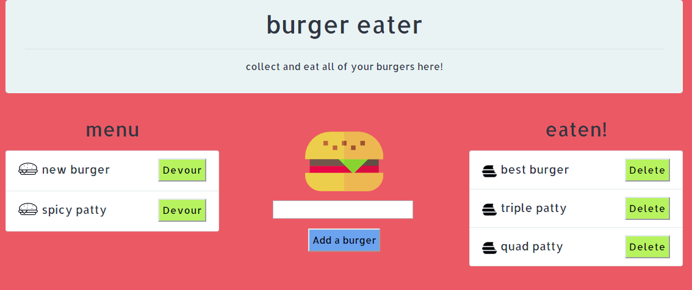

# burgerapp - Burger Eater

Is an Express based Node application that allows users to track the number of burgers they have eaten. Using an SQL database, users can enter new burger information and data, track existing burger data, and also delete that burger data if they so wish.

### link to project: 

<https://protected-meadow-35886.herokuapp.com/>

## Motivation

The overall design was intended to be colorful with minimal style in order to fully demonstrate the app's CRUD operations and capabilities.

## Application overview:

The application consists of a single page. The user may add a new burger to the list on the left side of the screen using the 'add a burger' input. After the burger has been added to the 'menu' list on the left, the user may then choose to 'devour' it, or any of the other burgers on the list, and this updates the burger's 'devoured' attribute in the database, thus moving it to the right side of the screen under the 'eaten!' header. The user may then choose to delete the burger from the list of eaten burgers via the 'delete' button. 

## Technologies used:

* SQL database
* Express
* Handlebars.js
* Bootstrap 4 framework

### Credits:

Icons made by:
* Flaticon from: <http://www.freepik.com> and <https://www.flaticon.com/> 
* Good Ware from: <https://www.flaticon.com/authors/good-ware> 
* Pixel Perfect from: <https://www.flaticon.com/authors/pixel-perfect>

Flaticon is licensed by <http://creativecommons.org/licenses/by/3.0/>

### Contributors:

* Nikolas Haug
